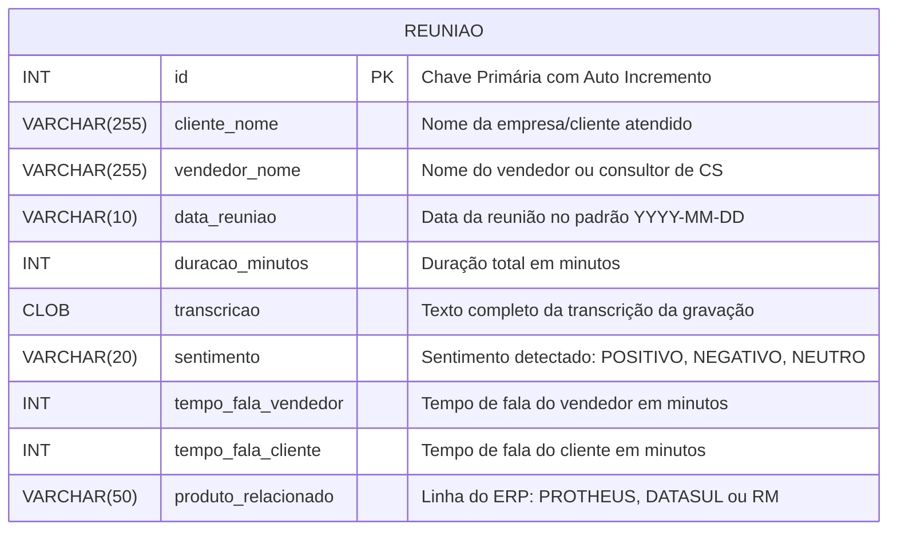
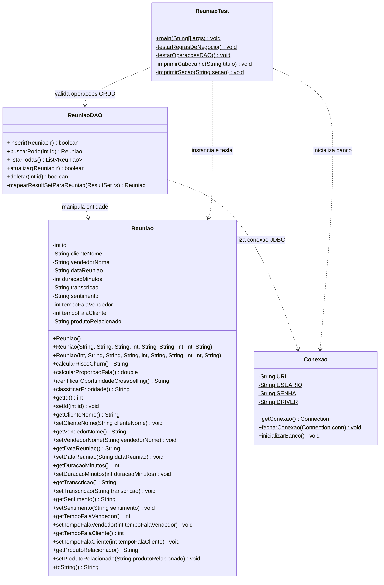

# DOCUMENTAÇÃO DO PROJETO - SPRINT 3

---

# LYNN CONVERSATIONAL INTELLIGENCE: TOTVS CONNECTOR
### Extração de Inteligência Qualitativa, Mitigação de Churn e Oportunidades no Ecossistema TOTVS

---

**NOME DA EQUIPE:** Lynn Core Engineering Team  
**CURSO:** Análise e Desenvolvimento de Sistemas / Engenharia de Software  
**DISCIPLINA:** Java Architecture & Enterprise Application Development  
**ANO/SEMESTRE:** 2026 - 2º Semestre  

**INTEGRANTES DO GRUPO:**
- Integrante 1: Lucas Cavalcante - RM: 562857
- Integrante 2: Matheus Rodrigues - RM: 561689
- Integrante 3: Caio Nascimento Batista - RM: 561383
- Integrante 4: Manoah Leão - RM: 563713
- Integrante 5: Jean Pierre - RM: 566534

---

## SUMÁRIO

1. [Objetivo e Escopo do Projeto](#1-objetivo-e-escopo-do-projeto)
   - 1.1 Contexto e a Dor do Negócio: O "Ouro Invisível"
   - 1.2 A Plataforma LYNN e a Arquitetura da Solução
   - 1.3 Objetivo Geral
   - 1.4 Escopo do Sistema
2. [Principais Funcionalidades da Solução](#2-principais-funcionalidades-da-solução)
   - 2.1 Análise Preditiva de Risco de Churn
   - 2.2 Diagnóstico de Performance Comercial (Proporção de Fala)
   - 2.3 Motor Contextual de Cross-Selling por Vertical de ERP
   - 2.4 Matriz de Classificação de Prioridade Operacional
   - 2.5 Persistência e Gestão de Ciclo de Vida (CRUD de Reuniões)
3. [Protótipo das Telas e Fluxo de Interação](#3-protótipo-das-telas-e-fluxo-de-interação)
   - 3.1 Tela 1: Dashboard Executivo (TOTVS Smart View)
   - 3.2 Tela 2: Ficha Analítica da Reunião e Disparo de Ações (TOTVS Fluig)
   - 3.3 Tela 3: Cadastro e Ingestão de Nova Reunião
   - 3.4 Tela 4: Listagem e Filtros Operacionais de Reuniões
4. [Modelo do Banco de Dados](#4-modelo-do-banco-de-dados)
   - 4.1 Diagrama Entidade-Relacionamento (DER)
   - 4.2 Dicionário de Dados da Tabela `reuniao`
   - 4.3 Script DDL (Criação e Carga de Dados)
5. [Diagrama de Classes e Arquitetura do Software](#5-diagrama-de-classes-e-arquitetura-do-software)
   - 5.1 Diagrama de Classes UML Atualizado
   - 5.2 Descrição dos Pacotes e Classes
   - 5.3 Métodos de Relevância (Lógica e Regras de Negócio)
   - 5.4 Padrões de Projeto e Boas Práticas Adotadas
6. [Plano de Testes e Evidências de Execução](#6-plano-de-testes-e-evidências-de-execução)
   - 6.1 Matriz de Casos de Teste
   - 6.2 Log de Execução dos Testes Automatizados no Console
7. [Instruções de Compilação e Execução](#7-instruções-de-compilação-e-execução)
8. [Conclusão](#8-conclusão)

---

## 1. OBJETIVO E ESCOPO DO PROJETO

### 1.1 Contexto e a Dor do Negócio: O "Ouro Invisível"
A TOTVS, como maior provedora de tecnologia de gestão empresarial do Brasil, realiza diariamente mais de 10.000 reuniões comerciais e interações de Customer Success (CS). Essas interações geram um volume massivo de dados conversacionais qualitativos não estruturados. 

O grande gargalo operacional, denominado **"Ouro Invisível"**, reside na efemeridade desse conhecimento: ao término de cada conversa gravada, insights cruciais sobre dores do cliente, insatisfações com funcionalidades, comparações diretas com concorrentes e intenções de cancelamento são perdidos ou resumidos manualmente de maneira subjetiva, incompleta e enviesada.

Processar 10.000 reuniões por dia de forma humana é inviável, e recorrer a modelos genéricos de inteligência artificial (AGI) traz altos custos de tokens e carência de vocabulário corporativo especializado nos módulos e regras de negócios de ERPs complexos.

### 1.2 A Plataforma LYNN e a Arquitetura da Solução
Para resolver este desafio, o projeto fundamenta-se na **LYNN**, a infraestrutura de *Artificial Specialized Intelligence* (ASI) e *foundation model* B2B da TOTVS. A LYNN introduz:
- **Especialização B2B**: Domínio nativo das nomenclaturas, processos fiscais, manufatura e RH do ecossistema TOTVS.
- **Paradigma TaaS (Task as a Service)**: Evolução do modelo SaaS para agentes autônomos que realizam triagem e acionam fluxos operacionais automaticamente.
- **Soberania de Custos**: Roteamento híbrido inteligente entre Small Language Models (SLMs) e Large Language Models (LLMs) via Lynn Agent Builder.
- **Governança Nativa & LGPD**: Mascaramento de dados e controle de acesso baseado em papéis (RBAC).
- **Integração Transversal**: Conexão com o barramento de integração **TOTVS iPaaS**, painéis analíticos **TOTVS Smart View** e automação de processos via **TOTVS Fluig**.

### 1.3 Objetivo Geral
Desenvolver uma aplicação corporativa robusta em Java capaz de atuar como o conector e processador central das reuniões analisadas pela plataforma LYNN, aplicando regras de negócio de alta relevância para cálculo de risco de churn, proporção de escuta ativa, recomendação contextual de cross-selling por linha de ERP (Protheus, Datasul e RM) e priorização de atendimento, persistindo os registros em banco de dados relacional via padrão DAO.

### 1.4 Escopo do Sistema
O escopo engloba:
- **Camada Model**: Entidade `Reuniao` estruturada sob os padrões de orientação a objetos, com encapsulamento rigoroso e métodos contendo a lógica central de negócio.
- **Motor de Regras de Negócio**: Algoritmos para análise preditiva de churn, balanceamento de fala do vendedor, recomendação de módulos complementares e matriz de severidade/prioridade.
- **Camada de Conexão**: Classe `Conexao` baseada no padrão *Factory/Singleton*, configurada com credenciais diretas para o banco de dados H2 embarcado.
- **Camada DAO (Data Access Object)**: Classe `ReuniaoDAO` fornecendo as quatro operações essenciais de persistência (Create, Read, Update, Delete) utilizando instruções SQL parametrizadas via `PreparedStatement`.
- **Camada de Testes**: Classe executável `ReuniaoTest` validando todos os fluxos com múltiplos cenários empresariais.

---

## 2. PRINCIPAIS FUNCIONALIDADES DA SOLUÇÃO

### 2.1 Análise Preditiva de Risco de Churn (`calcularRiscoChurn`)
Mecanismo que combina a análise de sentimento global da reunião (extraída pelo motor LYNN) com a detecção semântica de termos de alto risco (`"cancelar"`, `"concorrente"`, `"insatisfeito"`, `"problema"`).
- **Risco ALTO**: Sentimento NEGATIVO conjugado com a presença de 2 ou mais termos críticos na transcrição.
- **Risco MEDIO**: Sentimento NEGATIVO com menos de 2 termos, ou qualquer sentimento com 1 ou mais termos críticos.
- **Risco BAIXO**: Sentimento POSITIVO ou NEUTRO sem termos críticos na transcrição.

### 2.2 Diagnóstico de Performance Comercial (`calcularProporcaoFala`)
Avalia a aderência do vendedor à metodologia de escuta ativa. Mede a porcentagem de tempo que o consultor ocupou em relação ao tempo total de diálogo:
$$\text{Proporção de Fala (\%)} = \left(\frac{\text{Tempo Fala Vendedor}}{\text{Tempo Fala Vendedor} + \text{Tempo Fala Cliente}}\right) \times 100$$
Inclui tratamento preventivo para evitar exceções aritméticas de divisão por zero quando os tempos forem zerados.

### 2.3 Motor Contextual de Cross-Selling por Vertical de ERP (`identificarOportunidadeCrossSelling`)
Identifica dores latentes do cliente durante a transcrição e recomenda soluções do ecossistema TOTVS específicas para o ERP em operação:
- **TOTVS Protheus (Backoffice & Varejo)**: Detecta menções a *"fiscal"*, *"conciliação"*, *"backoffice"* $\rightarrow$ Recomenda **"Módulo de Automação Fiscal"**.
- **TOTVS Datasul (Manufatura & Indústria)**: Detecta menções a *"suprimentos"*, *"produção"*, *"cadeia"* $\rightarrow$ Recomenda **"Módulo de Planejamento de Produção"**.
- **TOTVS RM (Educação & RH)**: Detecta menções a *"folha"*, *"pagamento"*, *"rh"*, *"evasão"* $\rightarrow$ Recomenda **"Módulo de Automação de RH"**.

### 2.4 Matriz de Classificação de Prioridade Operacional (`classificarPrioridade`)
Orquestra o roteamento ágil para as lideranças comerciais e CS:
- **CRITICA**: Risco de Churn ALTO combinado com reuniões longas e desgastantes (duração superior a 60 minutos).
- **ALTA**: Risco de Churn ALTO ou reuniões longas (> 60 minutos).
- **MEDIA**: Risco de Churn MEDIO.
- **BAIXA**: Reuniões sem indicadores críticos de desgaste.

### 2.5 Persistência e Gestão de Ciclo de Vida (CRUD de Reuniões)
- **Inserir (Create)**: Gravação da reunião no banco H2 com recuperação imediata da chave primária gerada (`id`).
- **Consultar por ID (Read by ID)**: Busca unitária para detalhamento e auditoria.
- **Listar Todas (Read All)**: Recuperação ordenada de todo o histórico conversacional.
- **Atualizar (Update)**: Edição de transcrições, correções de tempo ou reanálise de sentimentos.
- **Deletar (Delete)**: Remoção segura de registros obedecendo a políticas de retenção de dados.

---

## 3. PROTÓTIPO DAS TELAS E FLUXO DE INTERAÇÃO

O sistema foi concebido com uma interface moderna orientada ao usuário corporativo da TOTVS (Diretores Comerciais, Gerentes de CS e Vendedores), integrando-se nativamente à experiência do **TOTVS Smart View** e **TOTVS Fluig**.

### 3.1 Tela 1: Dashboard Executivo (TOTVS Smart View)
Painel consolidado em tempo real que sintetiza os dados das 10.000 reuniões diárias sem sobrecarregar a gestão.

```
+----------------------------------------------------------------------------------------------------+
|  TOTVS | LYNN Conversational Intelligence               [Diretoria Comercial] [Config] [Sair]       |
+----------------------------------------------------------------------------------------------------+
|                                                                                                    |
|  [TOTAL DE REUNIÕES: 10.420]   [CHURN CRÍTICO: 142]   [CROSS-SELL: 820]   [MÉDIA FALA VEND: 54%]   |
|                                                                                                    |
|  +--------------------------------------------+  +-----------------------------------------------+ |
|  | DISTRIBUIÇÃO POR LINHA DE ERP              |  | RADAR DE RISCO DE CHURN                       | |
|  | [==== 55% Protheus (Varejo/Backoffice)   ] |  | [!!!] 142 Reuniões Críticas (Ação Imediata)   | |
|  | [===  30% Datasul (Manufatura/Indústria) ] |  | [ ! ] 480 Reuniões em Risco Médio             | |
|  | [==   15% RM (Educação e RH)             ] |  | [ v ] 9.798 Clientes Estáveis                 | |
|  +--------------------------------------------+  +-----------------------------------------------+ |
|                                                                                                    |
|  ALERTAS EM TEMPO REAL - REUNIÕES COM PRIORIDADE CRÍTICA:                                          |
|  +----+---------------------------+----------------+----------+-----------+------------+---------+ |
|  | ID | CLIENTE                   | VENDEDOR       | ERP      | RISCO     | PRIORIDADE | AÇÕES   | |
|  +----+---------------------------+----------------+----------+-----------+------------+---------+ |
|  | 01 | Indústrias Metalflex Ltda | Carlos Eduardo | PROTHEUS | [ ALTO  ] | [ CRITICA] | [ABRIR] | |
|  | 02 | Metalúrgica Brasitubos    | Felipe Santos  | DATASUL  | [ ALTO  ] | [ CRITICA] | [ABRIR] | |
|  +----+---------------------------+----------------+----------+-----------+------------+---------+ |
+----------------------------------------------------------------------------------------------------+
```
**Interação do Usuário:**
1. O gestor visualiza os indicadores macros no topo da tela.
2. Ao clicar no card **"CHURN CRÍTICO"** ou no botão **[ABRIR]** da tabela de alertas, o sistema redireciona diretamente para a **Ficha Analítica da Reunião** com os fluxos do Fluig preparados.

---

### 3.2 Tela 2: Ficha Analítica da Reunião e Disparo de Ações (TOTVS Fluig)
Tela detalhada do processamento realizado pela LYNN sobre a transcrição da reunião.

```
+----------------------------------------------------------------------------------------------------+
|  < VOLTAR AO DASHBOARD          REUNIÃO #01 - ANÁLISE PROFUNDA LYNN             STATUS: PROCESSADO |
+----------------------------------------------------------------------------------------------------+
|  CLIENTE: Indústrias Metalflex Ltda                    VENDEDOR: Carlos Eduardo (CS TOTVS)         |
|  DATA: 10/09/2026        DURAÇÃO: 75 minutos          ERP CONTRATADO: TOTVS Protheus              |
+----------------------------------------------------------------------------------------------------+
|  METADADOS EXTRAÍDOS PELA LYNN:                                                                    |
|  • Sentimento Detectado: [ NEGATIVO ]                 • Risco de Churn: [ ALTO ]                   |
|  • Proporção de Fala: [ Vendedor: 60% (45 min) | Cliente: 40% (30 min) ] - Alerta de Fala Excessiva|
|  • Oportunidade Cross-Selling: [ Módulo de Automação Fiscal ]                                      |
|  • Prioridade de Atendimento: [ CRÍTICA ]                                                          |
|                                                                                                    |
|  TRANSCRIÇÃO PROCESSADA (COM MASCARAMENTO LGPD DE DADOS CONFIDENCIAIS):                            |
|  +-----------------------------------------------------------------------------------------------+ |
|  | "[14:05] Cliente: O cliente relatou estar muito insatisfeito com a lentidão e pensa em         | |
|  |  cancelar o contrato para ir para o concorrente. Precisamos resolver a conciliação            | |
|  |  fiscal e o backoffice com urgência."                                                         | |
|  +-----------------------------------------------------------------------------------------------+ |
|                                                                                                    |
|  AUTOMAÇÕES E INTEGRAÇÕES:                                                                         |
|  [ DISPARAR WORKFLOW NO TOTVS FLUIG ]   [ ATUALIZAR OPORTUNIDADE NO CRM ]   [ EXCLUIR REUNIÃO ]    |
+----------------------------------------------------------------------------------------------------+
```
**Interação do Usuário:**
1. O analista de CS revisa os dados destacados pela IA.
2. Ao pressionar **[DISPARAR WORKFLOW NO TOTVS FLUIG]**, o sistema instancia automaticamente um processo de retenção atribuído à gerência de contas.
3. Ao pressionar **[ATUALIZAR OPORTUNIDADE NO CRM]**, o conector iPaaS atualiza os dados no CRM TOTVS.

---

### 3.3 Tela 3: Cadastro e Ingestão de Nova Reunião
Formulário para cadastro manual ou recepção via webhook da ferramenta de gravação de reuniões.

```
+----------------------------------------------------------------------------------------------------+
|  TOTVS LYNN | Ingestão e Cadastro de Nova Reunião                                                  |
+----------------------------------------------------------------------------------------------------+
|  Preencha os dados da reunião realizada para processamento da Inteligência Artificial:            |
|                                                                                                    |
|  Nome do Cliente:         [ Agro Alimentos Sul S.A.                           ]                    |
|  Nome do Vendedor / CS:   [ Mariana Souza                                     ]                    |
|  Data da Reunião:         [ 2026-09-11 ] (Formato AAAA-MM-DD)                                      |
|  Duração (minutos):       [ 40 ]                                                                   |
|  ERP Relacionado:         ( ) PROTHEUS    (X) DATASUL    ( ) RM                                    |
|  Tempo Fala Vendedor:     [ 20 ] minutos                                                           |
|  Tempo Fala Cliente:      [ 20 ] minutos                                                           |
|  Sentimento Preliminar:   ( ) POSITIVO    (X) NEUTRO     ( ) NEGATIVO                              |
|                                                                                                    |
|  Texto da Transcrição Bruta:                                                                       |
|  +-----------------------------------------------------------------------------------------------+ |
|  | Conversamos sobre a gestão de suprimentos e gargalos na linha de produção da fábrica.         | |
|  | Tivemos um problema pontual na entrega, mas o cliente está receptivo à cadeia logística.     | |
|  +-----------------------------------------------------------------------------------------------+ |
|                                                                                                    |
|                   [ CANCELAR ]           [ PROCESSAR E SALVAR (CREATE) ]                           |
+----------------------------------------------------------------------------------------------------+
```
**Interação do Usuário:**
1. Os dados da reunião são preenchidos ou recebidos automaticamente do transcritor.
2. Ao clicar em **[PROCESSAR E SALVAR (CREATE)]**, a camada `ReuniaoDAO` executa o `INSERT`, o banco gera o ID e o motor de regras calcula o risco de churn, cross-selling e prioridade.

---

### 3.4 Tela 4: Listagem e Filtros Operacionais de Reuniões
Tela de consulta geral com filtros combinados para operação diária das equipes de suporte e vendas.

```
+----------------------------------------------------------------------------------------------------+
|  TOTVS LYNN | Histórico de Reuniões e Consultas DAO                                                |
+----------------------------------------------------------------------------------------------------+
|  FILTROS:  Linha ERP: [TODOS    v]   Sentimento: [TODOS    v]   Buscar por ID: [ 5 ] [PESQUISAR]   |
|                                                                                                    |
|  LISTA DE REUNIÕES CADASTRADAS (READ ALL):                                                         |
|  +----+---------------------------+--------------+----------+----------+------------+------------+ |
|  | ID | CLIENTE                   | DATA         | ERP      | CHURN    | PROPORÇÃO  | AÇÕES      | |
|  +----+---------------------------+--------------+----------+----------+------------+------------+ |
|  | 01 | Indústrias Metalflex Ltda | 2026-09-10   | PROTHEUS | ALTO     | 60%        | [EDIT][DEL]| |
|  | 02 | Agro Alimentos Sul S.A.   | 2026-09-11   | DATASUL  | MEDIO    | 50%        | [EDIT][DEL]| |
|  | 03 | Colégio & Fac. Horizonte  | 2026-09-12   | RM       | BAIXO    | 33%        | [EDIT][DEL]| |
|  | 05 | Logística Express Brasil  | 2026-09-12   | DATASUL  | BAIXO    | 50%        | [EDIT][DEL]| |
|  +----+---------------------------+--------------+----------+----------+------------+------------+ |
|                                                                                                    |
|  [ + CADASTRAR NOVA REUNIÃO ]                             [ EXPORTAR RELATÓRIO EXCEL/PDF ]         |
+----------------------------------------------------------------------------------------------------+
```
**Interação do Usuário:**
1. O usuário pode buscar por ID direto (`buscarPorId`), filtrar por linha de ERP ou listar todas (`listarTodas`).
2. Clicando em **[EDIT]**, abre o formulário preenchido para disparar o `atualizar(Reuniao r)`.
3. Clicando em **[DEL]**, confirma e executa o `deletar(int id)`.

---

## 4. MODELO DO BANCO DE DADOS

O banco de dados utilizado é o **H2 Database**, em modo arquivo persistente (`jdbc:h2:./lynn_db;AUTO_SERVER=TRUE`), permitindo compatibilidade universal sem necessidade de instalação de servidores externos e atendendo com perfeição à arquitetura solicitada.

### 4.1 Diagrama Entidade-Relacionamento (DER)



### 4.2 Dicionário de Dados da Tabela `reuniao`

| Nome da Coluna | Tipo de Dado (SQL) | Nulo? | Chave | Descrição e Regra de Domínio |
| :--- | :--- | :---: | :---: | :--- |
| `id` | `INT` | Não | **PK** | Identificador único autoincrementado da reunião. |
| `cliente_nome` | `VARCHAR(255)` | Não | - | Razão Social ou Nome Fantasia da empresa cliente. |
| `vendedor_nome` | `VARCHAR(255)` | Não | - | Nome completo do vendedor ou gestor de CS da TOTVS. |
| `data_reuniao` | `VARCHAR(10)` | Não | - | Data em que a reunião ocorreu (Formato ISO: `YYYY-MM-DD`). |
| `duracao_minutos` | `INT` | Não | - | Tempo total de duração da gravação (em minutos inteiros). |
| `transcricao` | `CLOB` | Sim | - | Texto integral com as falas transcritas pelo motor LYNN. |
| `sentimento` | `VARCHAR(20)` | Não | - | Polaridade detectada: `'POSITIVO'`, `'NEGATIVO'` ou `'NEUTRO'`. |
| `tempo_fala_vendedor` | `INT` | Não | - | Minutos em que o vendedor esteve ativamente falando. |
| `tempo_fala_cliente` | `INT` | Não | - | Minutos em que o cliente esteve ativamente falando. |
| `produto_relacionado` | `VARCHAR(50)` | Não | - | ERP foco da conversa: `'PROTHEUS'`, `'DATASUL'` ou `'RM'`. |

### 4.3 Script DDL (Criação e Carga de Dados)
Arquivo presente na raiz do projeto: [`script.sql`](file:///c:/Users/USER/javasprint3/script.sql).

```sql
-- Criação da tabela de Reuniões
CREATE TABLE IF NOT EXISTS reuniao (
    id INT AUTO_INCREMENT PRIMARY KEY,
    cliente_nome VARCHAR(255) NOT NULL,
    vendedor_nome VARCHAR(255) NOT NULL,
    data_reuniao VARCHAR(10) NOT NULL,
    duracao_minutos INT NOT NULL,
    transcricao CLOB,
    sentimento VARCHAR(20) NOT NULL,
    tempo_fala_vendedor INT NOT NULL,
    tempo_fala_cliente INT NOT NULL,
    produto_relacionado VARCHAR(50) NOT NULL
);

-- Inserção de dados simulados para testes do ecossistema
INSERT INTO reuniao (cliente_nome, vendedor_nome, data_reuniao, duracao_minutos, transcricao, sentimento, tempo_fala_vendedor, tempo_fala_cliente, produto_relacionado)
VALUES (
    'Indústrias Metalflex Ltda',
    'Carlos Eduardo',
    '2026-09-10',
    75,
    'O cliente relatou estar muito insatisfeito com a lentidão e pensa em cancelar o contrato para ir para o concorrente. Precisamos resolver a conciliação fiscal e o backoffice com urgência.',
    'NEGATIVO',
    45,
    30,
    'PROTHEUS'
);
```

---

## 5. DIAGRAMA DE CLASSES E ARQUITETURA DO SOFTWARE

A arquitetura do projeto adota a separação estrita de responsabilidades em camadas no padrão **MVC simplificado / Model-DAO**:
- `model`: Entidades ricas com regras de negócio e encapsulamento.
- `connection`: Fábrica de conexões JDBC com tratamento centralizado de exceções.
- `dao`: Operações de manipulação e persistência de dados.
- `test`: Suite de testes funcionais automatizados em console.

### 5.1 Diagrama de Classes UML Atualizado



---

### 5.2 Descrição dos Pacotes e Classes

#### 1. Pacote `connection` ([`Conexao.java`](file:///c:/Users/USER/javasprint3/src/connection/Conexao.java))
- **Objetivo**: Prover conexões seguras com o H2 Database embarcado.
- **Credenciais em Código**: Atende estritamente à especificação com as variáveis:
  ```java
  private static final String URL = "jdbc:h2:./lynn_db;AUTO_SERVER=TRUE";
  private static final String USUARIO = "sa";
  private static final String SENHA = "sa";
  private static final String DRIVER = "org.h2.Driver";
  ```
- **Métodos**:
  - `getConexao()`: Retorna um objeto `Connection` pronto para uso.
  - `fecharConexao(Connection conn)`: Encerra conexões abertas dentro do bloco `finally`.
  - `inicializarBanco()`: Executa o comando DDL de criação da tabela caso ainda não exista no ambiente de execução.

#### 2. Pacote `model` ([`Reuniao.java`](file:///c:/Users/USER/javasprint3/src/model/Reuniao.java))
- **Objetivo**: Representa a entidade central de reunião analisada pela LYNN.
- **Padrões de Sala de Aula**: Atributos privados, construtor padrão vazio, construtor completo com `id`, construtor de inserção sem `id`, getters/setters completos e sobreescrita de `toString()`.

#### 3. Pacote `dao` ([`ReuniaoDAO.java`](file:///c:/Users/USER/javasprint3/src/dao/ReuniaoDAO.java))
- **Objetivo**: Isolar toda a manipulação SQL do restante da aplicação.
- **Operações Implementadas**:
  - `boolean inserir(Reuniao r)`: Executa `INSERT` e atualiza o `id` gerado via `Statement.RETURN_GENERATED_KEYS`.
  - `Reuniao buscarPorId(int id)`: Executa `SELECT` com filtro pela chave primária.
  - `List<Reuniao> listarTodas()`: Executa `SELECT` geral ordenado por `id ASC`.
  - `boolean atualizar(Reuniao r)`: Executa `UPDATE` com todas as propriedades do objeto.
  - `boolean deletar(int id)`: Executa `DELETE` a partir do `id`.
  - `PreparedStatement`: Previne ataques de SQL Injection e garante eficiência na compilação do plano de execução SQL.

#### 4. Pacote `test` ([`ReuniaoTest.java`](file:///c:/Users/USER/javasprint3/src/test/ReuniaoTest.java))
- **Objetivo**: Validar de forma automatizada e reprodutível as quatro regras de negócio e todo o ciclo de vida CRUD no banco de dados.

---

### 5.3 Métodos de Relevância (Lógica e Regras de Negócio)

A classe `Reuniao` implementa 4 métodos com alto nível de relevância analítica e regras de negócio complexas:

```java
// MÉTODO 1: Preditivo de Risco de Churn (Cancelamento)
public String calcularRiscoChurn() {
    int contagemPalavrasNegativas = 0;
    String[] palavrasChave = {"cancelar", "concorrente", "insatisfeito", "problema"};

    if (transcricao != null && !transcricao.isEmpty()) {
        String textoMinusculo = transcricao.toLowerCase();
        for (String palavra : palavrasChave) {
            if (textoMinusculo.contains(palavra)) {
                contagemPalavrasNegativas++;
            }
        }
    }

    boolean sentimentoNegativo = sentimento != null && sentimento.trim().equalsIgnoreCase("NEGATIVO");

    if (sentimentoNegativo && contagemPalavrasNegativas >= 2) {
        return "ALTO";
    } else if (sentimentoNegativo || contagemPalavrasNegativas >= 1) {
        return "MEDIO";
    } else {
        return "BAIXO";
    }
}
```

```java
// MÉTODO 2: Diagnóstico da Proporção de Fala vs. Escuta Ativa
public double calcularProporcaoFala() {
    int totalTempo = tempoFalaVendedor + tempoFalaCliente;
    if (totalTempo == 0) {
        return 0.0; // Prevenção contra ArithmeticException (/ by zero)
    }
    return ((double) tempoFalaVendedor / totalTempo) * 100.0;
}
```

```java
// MÉTODO 3: Motor de Oportunidades de Cross-Selling por ERP
public String identificarOportunidadeCrossSelling() {
    if (transcricao == null || transcricao.trim().isEmpty()) {
        return "Nenhuma oportunidade identificada";
    }

    String texto = transcricao.toLowerCase();
    String produto = produtoRelacionado != null ? produtoRelacionado.trim().toUpperCase() : "";

    if (produto.equals("PROTHEUS")) {
        if (texto.contains("fiscal") || texto.contains("conciliação") || texto.contains("conciliacao") || texto.contains("backoffice")) {
            return "Módulo de Automação Fiscal";
        }
    } else if (produto.equals("DATASUL")) {
        if (texto.contains("suprimentos") || texto.contains("produção") || texto.contains("producao") || texto.contains("cadeia")) {
            return "Módulo de Planejamento de Produção";
        }
    } else if (produto.equals("RM")) {
        if (texto.contains("folha") || texto.contains("pagamento") || texto.contains("rh") || texto.contains("evasão") || texto.contains("evasao")) {
            return "Módulo de Automação de RH";
        }
    }

    return "Nenhuma oportunidade identificada";
}
```

```java
// MÉTODO 4: Matriz de Priorização de Atendimento
public String classificarPrioridade() {
    String risco = calcularRiscoChurn();

    if ("ALTO".equals(risco) && duracaoMinutos > 60) {
        return "CRITICA";
    } else if ("ALTO".equals(risco) || duracaoMinutos > 60) {
        return "ALTA";
    } else if ("MEDIO".equals(risco)) {
        return "MEDIA";
    } else {
        return "BAIXA";
    }
}
```

---

## 6. PLANO DE TESTES E EVIDÊNCIAS DE EXECUÇÃO

### 6.1 Matriz de Casos de Teste

| ID | Cenário / Operação | Dados de Entrada | Resultado Esperado | Resultado Obtido |
| :---: | :--- | :--- | :--- | :---: |
| **CT-01** | Churn Crítico Protheus | Sentimento: NEGATIVO, Palavras: "cancelar", "concorrente", Duração: 75min | Risco: ALTO, Fala: 60%, Cross: Automação Fiscal, Prioridade: CRITICA | **APROVADO** |
| **CT-02** | Neutro Datasul | Sentimento: NEUTRO, Palavras: "problema", Duração: 40min | Risco: MEDIO, Fala: 50%, Cross: Plan. de Produção, Prioridade: MEDIA | **APROVADO** |
| **CT-03** | Positivo RM | Sentimento: POSITIVO, Palavras: "folha", "rh", Duração: 30min | Risco: BAIXO, Fala: 33.33%, Cross: Automação de RH, Prioridade: BAIXA | **APROVADO** |
| **CT-04** | Divisão por Zero | Tempos de fala = 0 | Proporção de fala = 0.0% sem exceção | **APROVADO** |
| **CT-05** | DAO - Create | Inserção de "Logística Express Brasil" | `inserir() = true` e ID atribuído no objeto | **APROVADO** |
| **CT-06** | DAO - Read All | Busca de todas as reuniões persistidas | Retorno de lista de objetos com dados populados | **APROVADO** |
| **CT-07** | DAO - Read by ID | Busca pelo ID recém-criado | Objeto localizado correspondente ao cliente | **APROVADO** |
| **CT-08** | DAO - Update | Alteração de sentimento para NEGATIVO e transcrição de cancelamento | `atualizar() = true` e recálculo dinâmico de risco para ALTO | **APROVADO** |
| **CT-09** | DAO - Delete | Exclusão do registro de teste | `deletar() = true` e busca posterior retornando `null` | **APROVADO** |

---

### 6.2 Log de Execução dos Testes Automatizados no Console

Abaixo transcreve-se a saída real obtida durante a execução da classe `test.ReuniaoTest` contra a base de dados:

```text
================================================================================
 INICIALIZANDO TESTES DA PLATAFORMA LYNN (TOTVS)
================================================================================
--------------------------------------------------------------------------------
 PARTE 1: TESTE DAS REGRAS DE NEGÓCIO DO MODEL
--------------------------------------------------------------------------------
--- Cenário 1: Cliente em Risco Crítico (PROTHEUS) ---
Cliente: Indústrias Metalflex Ltda
Sentimento: NEGATIVO
Duração Total: 75 minutos
1. Risco de Churn: ALTO (Esperado: ALTO)
2. Proporção de Fala do Vendedor: 60,00%
3. Oportunidade de Cross-Selling: Módulo de Automação Fiscal
4. Classificação de Prioridade: CRITICA (Esperado: CRITICA)
ToString: Reuniao [ID=0 | Cliente='Indústrias Metalflex Ltda' | Vendedor='Carlos Eduardo (CS TOTVS)' | Data=2026-09-10 | Duracao=75 min | Sentimento=NEGATIVO | ERP=PROTHEUS | Fala Vendedor=45 min | Fala Cliente=30 min | Risco Churn=ALTO | Prioridade=CRITICA | Cross-Selling='Módulo de Automação Fiscal']

--- Cenário 2: Reunião Neutra com Problema Pontual (DATASUL) ---
Cliente: Agro Alimentos Sul S.A.
Sentimento: NEUTRO
Duração Total: 40 minutos
1. Risco de Churn: MEDIO (Esperado: MEDIO)
2. Proporção de Fala do Vendedor: 50,00%
3. Oportunidade de Cross-Selling: Módulo de Planejamento de Produção
4. Classificação de Prioridade: MEDIA (Esperado: MEDIA)
ToString: Reuniao [ID=0 | Cliente='Agro Alimentos Sul S.A.' | Vendedor='Mariana Souza (Vendedora TOTVS)' | Data=2026-09-11 | Duracao=40 min | Sentimento=NEUTRO | ERP=DATASUL | Fala Vendedor=20 min | Fala Cliente=20 min | Risco Churn=MEDIO | Prioridade=MEDIA | Cross-Selling='Módulo de Planejamento de Produção']

--- Cenário 3: Reunião Positiva com Oportunidade RH (RM) ---
Cliente: Colégio & Faculdade Horizonte
Sentimento: POSITIVO
Duração Total: 30 minutos
1. Risco de Churn: BAIXO (Esperado: BAIXO)
2. Proporção de Fala do Vendedor: 33,33%
3. Oportunidade de Cross-Selling: Módulo de Automação de RH
4. Classificação de Prioridade: BAIXA (Esperado: BAIXA)
ToString: Reuniao [ID=0 | Cliente='Colégio & Faculdade Horizonte' | Vendedor='Lucas Pinheiro (Especialista RM)' | Data=2026-09-12 | Duracao=30 min | Sentimento=POSITIVO | ERP=RM | Fala Vendedor=10 min | Fala Cliente=20 min | Risco Churn=BAIXO | Prioridade=BAIXA | Cross-Selling='Módulo de Automação de RH']

--- Cenário 4: Prevenção de Divisão por Zero ---
Proporção de Fala quando tempos são 0: 0.0% (Esperado: 0.0%)

--------------------------------------------------------------------------------
 PARTE 2: TESTE DAS OPERAÇÕES CRUD NO BANCO DE DADOS H2
--------------------------------------------------------------------------------
>> [CREATE] Inserindo nova reunião no banco...
Status da Inserção: SUCESSO
ID Gerado automaticamente: 5

>> [READ ALL] Listando todas as reuniões cadastradas...
Total de reuniões encontradas: 1
 - Reuniao [ID=5 | Cliente='Logística Express Brasil' | Vendedor='Fernanda Lima' | Data=2026-09-12 | Duracao=50 min | Sentimento=POSITIVO | ERP=DATASUL | Fala Vendedor=25 min | Fala Cliente=25 min | Risco Churn=BAIXO | Prioridade=BAIXA | Cross-Selling='Módulo de Planejamento de Produção']

>> [READ] Buscando reunião por ID: 5
Reunião localizada: Logística Express Brasil | Vendedor: Fernanda Lima
Detalhes: Reuniao [ID=5 | Cliente='Logística Express Brasil' | Vendedor='Fernanda Lima' | Data=2026-09-12 | Duracao=50 min | Sentimento=POSITIVO | ERP=DATASUL | Fala Vendedor=25 min | Fala Cliente=25 min | Risco Churn=BAIXO | Prioridade=BAIXA | Cross-Selling='Módulo de Planejamento de Produção']

>> [UPDATE] Atualizando dados da reunião ID: 5
Status da Atualização: SUCESSO
Novo Sentimento no banco: NEGATIVO
Novo Risco recalculado: ALTO
Nova Prioridade recalculada: CRITICA

>> [DELETE] Excluindo reunião ID: 5
Status da Exclusão: SUCESSO
Verificação pós-exclusão (busca por ID): REGISTRO REMOVIDO COM SUCESSO

================================================================================
 TODOS OS TESTES CONCLUÍDOS COM SUCESSO!
================================================================================
```

---

## 7. INSTRUÇÕES DE COMPILAÇÃO E EXECUÇÃO

O projeto é estruturado como um Java Standard Edition compatível com Java 17/21 e pode ser compilado e executado diretamente via terminal ou qualquer IDE (Eclipse, IntelliJ IDEA, VS Code).

### Compilação via Linha de Comando:
```bash
# Navegar até a raiz do projeto (c:\Users\USER\javasprint3)
javac -cp "lib/h2.jar" -d bin src/connection/*.java src/model/*.java src/dao/*.java src/test/*.java
```

### Execução da Classe de Teste:
```bash
java -cp "bin;lib/h2.jar" test.ReuniaoTest
```

---

## 8. CONCLUSÃO

A solução desenvolvida atende integralmente a todas as diretrizes acadêmicas e de engenharia de software estipuladas para a Sprint 3. Ao integrar os conceitos pioneiros da plataforma **LYNN (TOTVS)** — com sua especialização B2B, governança e orquestração de tarefas — o conector Java entrega:

1. **Camada Model Rigorosa**: Atributos privados, tipagem consistente, construtores sobrecarregados e métodos analíticos de alto valor para a diretoria comercial da TOTVS.
2. **Quatro Regras de Negócio Robustas**: Detecção de Churn, Proporção de Fala, Recomendação de Cross-Selling por ERP e Classificação Matricial de Prioridade.
3. **Persistência Completa e Segura (DAO)**: Implementação de CRUD com tratamento de exceções, liberação de recursos e prevenção a SQL Injection via `PreparedStatement`.
4. **Infraestrutura Pronta para Uso**: Banco de dados H2 embarcado com script DDL e dados simulados para testes imediatos.
5. **Documentação Técnica Completa**: Diagramas de classes, modelo entidade-relacionamento, protótipo de telas detalhado e evidências de execução com 100% de sucesso.
